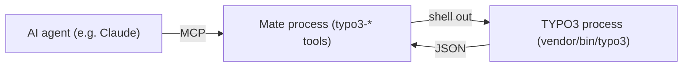

<div align="center">


# TYPO3 extension `typo3_ai_mate`

[](https://packagist.org/packages/konradmichalik/typo3-ai-mate)
[](https://packagist.org/packages/konradmichalik/typo3-ai-mate)

[](https://packagist.org/packages/konradmichalik/typo3-ai-mate)
[](https://github.com/konradmichalik/typo3-ai-mate/actions/workflows/cgl.yml)
[](https://coveralls.io/github/konradmichalik/typo3-ai-mate)
[](https://github.com/konradmichalik/typo3-ai-mate/actions/workflows/tests.yml)
[](LICENSE.md)

</div>

A _dev-only_ TYPO3 introspection bridge for AI coding assistants. It exposes the **resolved runtime state** of an installation — TCA, page composition, resolved TypoScript, the PSR-15 middleware order, logs and per-request profiles — to assistants like Claude Code, Cursor or Copilot over [**MCP**](https://modelcontextprotocol.io/), so they reason from facts instead of guessing from source files.

> [!WARNING]
> This package is in early development stage and may change significantly in the future. I am working steadily to release a stable version as soon as possible.

> [!IMPORTANT]
> This package is **active only in a Development context** (`Environment::getContext()->isDevelopment()`).

## 🤔 Why

AI assistants normally read your raw source and config files and _guess_ at the result. But the state that actually matters — the merged TCA, the resolved TypoScript of a page, the real PSR-15 middleware order, whether a request was cached — is computed at runtime and can't be reliably inferred from files alone.

`typo3-ai-mate` hands the assistant that already-resolved state instead — see [Tools](#tools) below for the full list of what it exposes. This is often more token-efficient too: a compact resolved summary costs far fewer tokens than having the assistant read and reason over the raw source and config files.

### Use cases

- **[Slow page](docs/USE-CASES.md#slow-page)** — _"This page is slow — find the performance problem."_ The assistant reads the profile, spots N+1 queries / cache state / timing, and diagnoses instead of guessing.
- **[Error page](docs/USE-CASES.md#error-page)** — locate an exception in the logs and tie it back to the page that produced it.
- **[Major upgrade](docs/USE-CASES.md#major-upgrade-any-lts-jump-eg-v13--v14)** — surface breaking code, outstanding migrations and runtime deprecations before a major jump.

## 🔥 Installation

### Requirements

* TYPO3 13.4 LTS & 14.3 LTS
* PHP 8.2+
* Composer mode

### Composer

[](https://packagist.org/packages/konradmichalik/typo3-ai-mate)
[](https://packagist.org/packages/konradmichalik/typo3-ai-mate)

```bash
composer require --dev konradmichalik/typo3-ai-mate
```

> [!NOTE]
> Requiring `typo3-ai-mate` automatically pulls in `symfony/ai-mate` (the MCP server and `mate` binary) and [`konradmichalik/typo3-ai-mate`](https://packagist.org/packages/konradmichalik/typo3-ai-mate) (the profile source for the `typo3-profiler-*` tools) — no separate installs needed.

### TER

[](https://extensions.typo3.org/extension/typo3_ai_mate)
[](https://extensions.typo3.org/extension/typo3_ai_mate)

Download the zip file from [TYPO3 extension repository (TER)](https://extensions.typo3.org/extension/typo3_ai_mate).

## 🔌 Connect your assistant

One command scaffolds the Mate workspace, registers the `typo3-*` tools and adds the MCP server to the configuration file your assistant reads:

```bash
vendor/bin/typo3 typo3-ai-mate:install
```

It detects whether the project runs under DDEV and registers the matching launch command (`ddev exec vendor/bin/mate serve` vs. `./vendor/bin/mate serve`), never touches entries already in the file, and is safe to run again after every `composer update`.

| Assistant | File | Entry |
|---|---|---|
| Claude Code | `.mcp.json` | `mcpServers.typo3-ai-mate` with `command` and `args` |
| opencode | `opencode.json` | `mcp.typo3-ai-mate` with `type: local`, one `command` array and `enabled: true` |

Which one gets written is decided by `--agent=<claude\|opencode\|all>`. Without it the project is inspected (`.mcp.json`, `.claude/`, `CLAUDE.md` → Claude Code; `opencode.json`, `.opencode/` → opencode) and every recognised harness is registered; when nothing is recognisable, all of them are. Registering for only one leaves the others with instructions for tools they cannot call, which is worse than either extreme.

`--dry-run` reports every planned change without writing anything; `--skip-mcp-json` runs the Mate workspace steps only, in case your assistant registers MCP servers another way.

> [!NOTE]
> `mate init` also leaves `bin/codex` and `bin/codex.bat` in the project — launcher shims for the Codex CLI, written by `symfony/ai-mate` rather than by this extension. A Windows batch file appearing in a Composer-managed project is unexpected; it is harmless and can be deleted or gitignored if you do not use Codex. Codex itself registers MCP servers in a global `~/.codex/config.toml`, outside the project, and is therefore not a target of `--agent`.

> [!NOTE]
> `mate discover` writes the aggregated instructions (this extension's `INSTRUCTIONS.md` plus every other installed Mate extension's) to `mate/AGENT_INSTRUCTIONS.md`, and adds a managed `<!-- BEGIN AI_MATE_INSTRUCTIONS --> … <!-- END AI_MATE_INSTRUCTIONS -->` block to `AGENTS.md` pointing at it. It does **not** write to `CLAUDE.md`, `.cursor/rules`, or any other client-specific file — only `AGENTS.md`. If your assistant reads `AGENTS.md` directly, you are covered automatically. **Claude Code reads `CLAUDE.md`, not `AGENTS.md`** — add a single line to your project's `CLAUDE.md` — `@AGENTS.md` — so it gets pulled in; do not hand-write a second managed block, Mate's own markers above are the only ones this project uses. Any other assistant that only reads its own client-specific file (e.g. `.cursor/rules`) needs the same kind of import.

> [!NOTE]
> After updating the package (`composer update`), **re-run the install command and reconnect the MCP server** so the assistant picks up new or changed tool schemas — in Claude Code run `/mcp` and reconnect `typo3-ai-mate`. Freshly installed vendor code alone is not enough; without a reconnect the assistant keeps using the previously registered tool definitions. The same applies mid-session: a few tool descriptions (the profiler tools, `typo3-render-page`) state current runtime facts — whether a profile exists yet, whether profiling is active, which hosts are allowed — captured once when the server started. If that state changes (a profile gets recorded, profiling gets toggled), reconnect to see it reflected in the description.

## ⚙️ How it works

The MCP tools run in the **Mate process** (its own Symfony DI container, `Configuration/Mate.php`). They boot no TYPO3; they reach it by shelling out to `vendor/bin/typo3 <command>` (`TYPO3_CONTEXT=Development`, stdout→JSON) via the `Typo3CliRunner` service, or by reading profile artifacts directly. The console commands run in the **TYPO3 process** (TYPO3 DI, `Configuration/Services.yaml`) and emit raw JSON.



### Tools

| Area | MCP tool | Purpose |
|---|---|---|
| Profiling | `typo3-profiler-latest` / `-list` / `-search` / `-get` | Inspect recorded per-request profiles as compact summaries (timing, N+1, cache, `page.id`, `activation_mode`), each linking a `typo3-profiler://profile/{token}` resource for the full SQL/section detail. |
| Profiling control | `typo3-profiler-start` / `-stop` / `-status` | Enable request profiling for a bounded window (`duration` e.g. `15m`, capped at 60 minutes), disable it again, and report the remaining time — so an agent can turn profiling on, exercise the site and read the resulting profiles in one session. Writes go through the profiler's own `profiler:activate`/`:deactivate` commands and therefore require those to be registered as console commands; `-status` reads the state file directly and therefore reflects only this window, not the Development context or the per-request header trigger (a profile's `activation_mode` records which mode actually applied). |
| Page | `typo3-page` | Show a page's composition: content elements, cache signals and `USER_INT` plugins. |
| Records | `typo3-records` | Read-only record query for any table (structured, parameterised — equality filters via `uid`/`pid`/`where`, never raw SQL). Returns compact rows (uid, pid, label/type, enable columns, timestamps; long text truncated) each with a `_flags` list (hidden/deleted/timed/fe_group). No restrictions by default so hidden/deleted rows are visible — the answer to "why is this record not showing?". Pass `fields` for specific columns, `mode=full` for all columns, `respectEnableFields=true` for the frontend view. Sensitive columns (passwords and `password`-type TCA fields) are always redacted, and any embedded emails, IPv4 addresses or secrets in text values are redacted too. |
| Logs | `typo3-logs-search` / `-tail` / `-by-level` | Search, tail or filter the TYPO3 logs. Returns a compact summary (distinct messages with occurrence counts and `lastSeen`, no stack traces) by default; pass `mode=full` for individual entries with truncated traces, and `since` (e.g. `1h`, `2d`) to scope to recent entries. Emails, IPv4 addresses and secrets embedded in messages/traces are redacted before output. |
| TCA | `typo3-tca` | Dump the resolved (merged, trimmed) TCA of a table, or narrow it to one `recordType` or a set of `fields`. |
| FlexForm | `typo3-flexform` | Reconcile a record's stored FlexForm against the data structure currently valid for it, resolved through `FlexFormTools` from the record's own pointer field. Reports `orphaned` values (stored but no longer declared, so silently ignored at runtime — what a renamed field looks like) and `missing` fields (declared but not stored, so the default applies). A record without a FlexForm answers `hasFlexForm: false` rather than an empty structure. |
| TypoScript | `typo3-typoscript` | Dump the resolved frontend TypoScript of a page. |
| TSconfig | `typo3-tsconfig` | Dump the resolved Page TSconfig (rootline-merged: `mod.*`, `TCEFORM`, `TCEMAIN`, RTE) or User TSconfig — the backend configuration layer that no single file reveals. Scope large output with a dotted path, e.g. `mod.web_layout`. |
| Fluid | `typo3-fluid-resolve` | Resolve the `templateRootPaths`/`partialRootPaths`/`layoutRootPaths` override chain for a plugin/view (e.g. `plugin.tx_news_pi1`) and report which physical template/partial/layout file wins — ordered candidate directories with `exists` flags plus the resolved file. |
| Fluid | `typo3-fluid-namespaces` | Which ViewHelper prefixes a template may use without declaring them, mapped to the PHP namespaces they resolve to in order. Takes no arguments. Read from the `ViewHelperResolver`, so on v14 it already reflects the merge of every package's `Configuration/Fluid/Namespaces.php` with the deprecated `TYPO3_CONF_VARS` registration and any `ModifyNamespacesEvent` listener. |
| Icons | `typo3-icons` | Whether icon identifiers are registered and which extension provides them. `registered: false` is the answer, not an empty result — an unregistered identifier renders no icon at all. A miss carries the closest registered identifiers as suggestions, so a half-remembered name is answered rather than denied; without arguments you get the identifier count grouped by leading segment. |
| Backend modules | `typo3-backend-modules` | Registered backend modules with their parent, route path, access level and *resolved* navigation component — a submodule declaring `inheritNavigationComponent` reports its parent's, which its own `Configuration/Backend/Modules.php` does not show. Takes no arguments, applies no user context. |
| Middlewares | `typo3-middlewares` | List the resolved PSR-15 middleware order. |
| Events | `typo3-events` | List the resolved PSR-14 event listener registry. |
| Upgrade | `typo3-upgrade-wizards` | List pending and completed upgrade wizards — outstanding DB/config migrations. |
| Extension scanner | `typo3-extension-scanner` | Statically scan an extension — or all non-core extensions — against the core breaking/deprecation matchers. Returns a compact summary by default (matches grouped by message with strong/weak counts and the affected files, plus a per-origin rollup when scanning all); pass `mode=full` for individual matches with line content, and `ownCode=true` to skip third-party (vendor) packages. |
| Deprecations | `typo3-deprecations` | Report runtime deprecation notices, deduplicated and counted. Each one carries `origins` — the likely caller in own code. With deprecation logging enabled, a dev-only log processor records the caller's backtrace at log time for a high-confidence file:line; otherwise it falls back to a class-aware static reverse search across own PHP/Fluid files. |
| Rendering | `typo3-render-page` | Render a frontend page via an internal HTTP request (no external curl/Playwright) so runtime notices fire, and report the HTTP status plus the log entries written during that request. Requires a running webserver (e.g. DDEV). An explicit `--url` is only allowed for the installation's configured site hosts (SSRF guard) and the request is capped at 60s. |

### Tool clusters gated on runtime state

Two clusters are only registered when they have something to report: the profile-reading tools (`typo3-profiler-latest` / `-list` / `-search` / `-get`, plus `-stop` / `-status`) once a profile exists or profiling is active, and the log search tools (`typo3-logs-search`, `typo3-logs-by-level`) once the log has entries. Until then only `typo3-profiler-start` and `typo3-logs-tail` are offered, with a description saying what is missing and how to get the rest.

This is not deletion: a cluster whose subject does not exist yet costs the model a longer name list on every tool search and returns nothing when called. `typo3-info` reports the current state under `toolClusters` with the reason for each, so a tool that seems missing can be explained rather than guessed at. Reconnect the MCP server after recording a profile or triggering a log entry to pick the cluster up.

## 🔒 Security model

**Read-only by default.** 29 of the 32 tools only read resolved runtime state and are annotated `readOnlyHint: true` in `tools/list`, so an MCP client can run them without a confirmation prompt. The exceptions are annotated explicitly, never left to prose:

- `typo3-profiler-start` / `-stop` — the only tools that change profiler control state, and only a time-boxed dev switch (max 60 minutes); they touch no records.
- `typo3-render-page` — issues a real internal HTTP request, so it has side effects in caches and logs (`readOnlyHint: false`, `openWorldHint: true`). Its URL is restricted to the installation's configured site hosts (SSRF guard).

No tool executes arbitrary code and none expose a raw SQL surface — `typo3-records` is a structured, parameterised query (equality filters only), never a `SELECT` string. Every command runs only in a Development context (`Environment::getContext()->isDevelopment()`).

See [`DEVELOPMENT.md`](DEVELOPMENT.md) for the full security notes (redaction, path-traversal guards, CLI argument hardening).

## 💡 Development

Custom `typo3-*` tools and the `Typo3CliRunner` recipe live in [`DEVELOPMENT.md`](DEVELOPMENT.md).

## 🔗 Related

[`hauptsacheNet/typo3-mcp-server`](https://github.com/hauptsacheNet/typo3-mcp-server) is a complementary project with a different goal: it gives assistants a native MCP server to **create, edit and translate TYPO3 content**, safely gated behind workspaces. `typo3-ai-mate` deliberately writes **no content** — it is a dev-only **diagnostics** bridge for the resolved runtime state (performance, TypoScript, middlewares, logs). Its only write is the profiling toggle (`typo3-profiler-start`/`-stop`), which flips a time-boxed dev switch and touches no records. Use the former to edit content, the latter to debug it; they sit happily side by side.

## 🧑‍💻 Contributing

Please have a look at [`CONTRIBUTING.md`](CONTRIBUTING.md).

## ⭐ License

This project is licensed under [GNU General Public License 2.0 (or later)](LICENSE.md).
