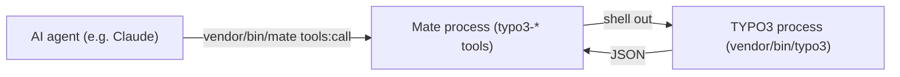

<div align="center">


# TYPO3 extension `typo3_ai_mate`

[](https://packagist.org/packages/konradmichalik/typo3-ai-mate)

[](https://packagist.org/packages/konradmichalik/typo3-ai-mate)
[](https://github.com/konradmichalik/typo3-ai-mate/actions/workflows/cgl.yml)
[](https://coveralls.io/github/konradmichalik/typo3-ai-mate)
[](https://github.com/konradmichalik/typo3-ai-mate/actions/workflows/tests.yml)
[](LICENSE.md)

</div>

AI assistants normally read your raw source and config files and guess at the result. But the state that actually matters, the merged TCA, the resolved TypoScript of a page, the real PSR-15 middleware order, whether a request was cached, is computed at runtime and cannot be reliably inferred from files alone.

This _dev-only_ extension hands the assistant that already-resolved state instead, through [`symfony/ai-mate`](https://github.com/symfony/ai-mate)'s `mate` CLI. It is usually cheaper too: a compact resolved summary costs far fewer tokens than having the assistant read and reason over the raw sources.

> [!WARNING]
> This package is in early development stage and may change significantly in the future. I am working steadily to release a stable version as soon as possible.

> [!IMPORTANT]
> This package is **active only in a Development context** (`Environment::getContext()->isDevelopment()`).

## ✨ Features

- **32 read-only diagnostic tools** over the resolved runtime state: TCA, page composition, records, TypoScript, TSconfig, Fluid resolution, PSR-15 and PSR-14 chains, logs, per-request profiles and more. See the [tool reference](docs/tools.md).
- **Answers, not empty structures.** A miss reports `registered: false` or `unsupported` with a reason, so an assistant stops instead of retrying with different arguments.
- **Prompt-injection aware.** Output captured from the installation arrives wrapped as [untrusted data](docs/security.md#untrusted-data), never as instructions.
- **Diagnose without booting TYPO3 twice.** The tools shell out to the installation's own console, so they report what it actually computed. See [how it works](docs/how-it-works.md).
- **Upgrade support**: static breaking-change scan, outstanding wizards, runtime deprecations with own-code origins, and offline changelog search. See [use cases](docs/use-cases.md).

## 🔥 Installation

### Requirements

* TYPO3 13.4 LTS & 14.3 LTS
* PHP 8.2+
* Composer mode

### Composer

[](https://packagist.org/packages/konradmichalik/typo3-ai-mate)
[](https://packagist.org/packages/konradmichalik/typo3-ai-mate)

```bash
composer require --dev konradmichalik/typo3-ai-mate
```

> [!NOTE]
> Requiring `typo3-ai-mate` automatically pulls in `symfony/ai-mate` (the `mate` CLI) and [`konradmichalik/typo3-request-profiler`](https://packagist.org/packages/konradmichalik/typo3-request-profiler) (the profile source for the `typo3-profiler-*` tools). No separate installs needed.

### TER

[](https://extensions.typo3.org/extension/typo3_ai_mate)
[](https://extensions.typo3.org/extension/typo3_ai_mate)

Download the zip file from [TYPO3 extension repository (TER)](https://extensions.typo3.org/extension/typo3_ai_mate).

## 🚀 Quick start

One command scaffolds the Mate workspace and materializes the agent instructions:

```bash
vendor/bin/typo3 typo3-ai-mate:install
```

That is all it does: it runs `mate init` and `mate discover`. Re-run it after every `composer update` so changed tool descriptions reach `mate/AGENT_INSTRUCTIONS.md`, then reload your assistant.

There is no server process to connect to. Your assistant calls the tools by running `vendor/bin/mate tools:call <name> --<param>=<value>` as a shell command, guided by a managed `CLAUDE.md`/`AGENTS.md` block that `mate init` writes. An assistant that reads only its own file, such as `.cursor/rules`, needs that import added by hand.

See [connecting an assistant](docs/connecting-an-assistant.md) for what exactly gets written, the Agent Skills that come along, and what to clean up when upgrading from 0.4 or earlier.

## 📖 How it works

The `typo3-*` tools run in the Mate process, invoked per call by `vendor/bin/mate tools:call`. They boot no TYPO3: they reach it by shelling out to `vendor/bin/typo3 <command>` and reading its JSON, or by reading profile artifacts directly.



Details, including why tool descriptions cannot carry runtime state, are in [how it works](docs/how-it-works.md).

## 🔒 Security

Read-only by default: only `typo3-profiler-start`, `-stop` and `typo3-render-page` mutate anything, and every command refuses to run outside a Development context. PII and secrets are redacted, `typo3-render-page` is restricted to configured site hosts, and application-derived output is flagged as untrusted data.

Full guard list and the trust boundary: [Security](docs/security.md).

## 🔗 Related

Other projects connect assistants to TYPO3 and answer different questions: [`TYPO3/dev-companion`](https://github.com/TYPO3/dev-companion) supplies version-bound TYPO3 knowledge, while [`hauptsacheNet/typo3-mcp-server`](https://github.com/hauptsacheNet/typo3-mcp-server) and [`marekskopal/typo3-mcp-server`](https://github.com/marekskopal/typo3-mcp-server) write content. This extension writes none and reports what one installation actually computed, so it sits next to them rather than against them.

Which one you want, and why more than one is often the answer: [Related projects](docs/related.md).

## 📚 Documentation

| Page | What is inside |
| --- | --- |
| [Tool reference](docs/tools.md) | Every tool, what it answers, and which clusters can come back empty |
| [Connecting an assistant](docs/connecting-an-assistant.md) | What `mate init`/`discover` write, Agent Skills, upgrading from 0.4 |
| [How it works](docs/how-it-works.md) | The two-process architecture and why descriptions are static |
| [Security](docs/security.md) | Trust boundary, guards, and the untrusted-data envelope |
| [Use cases](docs/use-cases.md) | Slow page, error page, major upgrade, and the `request_id` anchor |
| [Extending](docs/extending.md) | Writing your own `typo3-*` tool against `Typo3CliRunner` |
| [Tool surface](docs/tool-surface.md) | What the tool count costs a session, measured rather than argued |
| [Related projects](docs/related.md) | How this compares to dev-companion and the two typo3-mcp-server projects |

## 🧑‍💻 Contributing

Please have a look at [`CONTRIBUTING.md`](CONTRIBUTING.md). Changes worth knowing about are recorded in [`CHANGELOG.md`](CHANGELOG.md).

## ⭐ License

This project is licensed under [GNU General Public License 2.0 (or later)](LICENSE.md).
