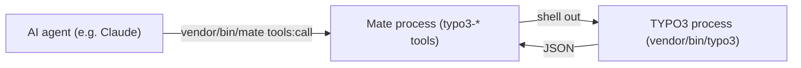

# How it works

The `typo3-*` tools run in the **Mate process** (its own Symfony DI container, `Configuration/Mate.php`), invoked per call by `vendor/bin/mate tools:call`. They boot no TYPO3; they reach it by shelling out to `vendor/bin/typo3 <command>` (`TYPO3_CONTEXT=Development`, stdout→JSON) via the `Typo3CliRunner` service, or by reading profile artifacts directly. The console commands run in the **TYPO3 process** (TYPO3 DI, `Configuration/Services.yaml`) and emit raw JSON.

## Tool descriptions are static

A `#[MateTool(description: …)]` argument must be a PHP compile-time constant, and unlike mcp/sdk's old `#[McpTool]`, ai-mate v0.13's discovery classes (`ReflectionDiscoverer`, `CapabilityRegistry`) are `final` with no interface — there is no seam left to decorate discovery and splice runtime state into a description or hide a tool from the list, the way `Mate\DescriptionAwareDiscoverer` (removed) used to for the profiler/logs clusters.

State that used to live in a description suffix (e.g. "no profiles exist yet") now lives only in two places:

- **`typo3-info`'s `toolClusters`** (`Command\InfoCommand::describeToolClusters()`, backed by `Support\ToolClusterGate`/`Support\RuntimeArtifacts`) reports whether the profiler/logs clusters currently have anything to report, evaluated fresh on every call. Purely advisory — every tool stays registered and callable regardless.
- **The tool's own runtime response.** Calling a tool with nothing behind it (e.g. `typo3-profiler-latest` before any profile exists) answers `ToolResult::from(['error' => '...'])`/`::untrusted(...)`, which `ToolResult` turns into `{"unsupported": true, "reason": "..."}` — an honest miss rather than a wasted guess.

If you add a tool whose usefulness depends on runtime state, follow this pattern: keep the `#[MateTool]` description static and general, and have the method itself report `unsupported`/`reason` when its precondition is not met.
